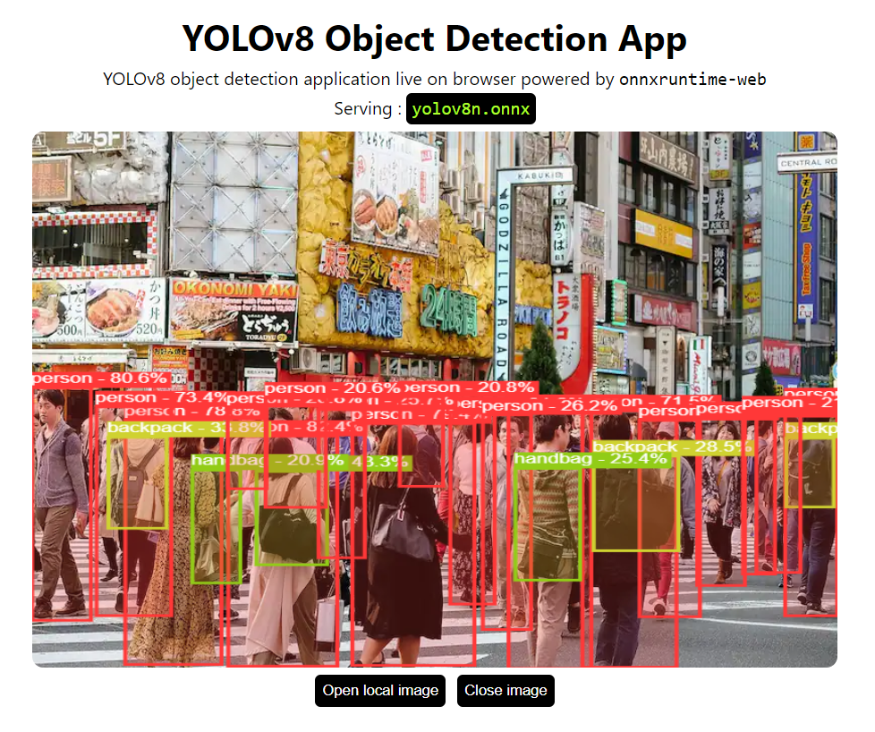

# YOLOv8 with onnxruntime-web

<p align="center">
  
</p>


---

Object Detection application right in your browser.
Serving YOLOv8 in browser using onnxruntime-web with `wasm` backend.

## Setup

```bash
git clone https://github.com/Hyuto/yolov8-onnxruntime-web.git
cd yolov8-onnxruntime-web
yarn install # Install dependencies
```

## Scripts

```bash
yarn start # Start dev server
yarn build # Build for productions
```

## Models

**Main Model**

YOLOv8n model converted to onnx.

```
used model : yolov8n.onnx
size       : 13 Mb
```

**NMS**

ONNX model to perform NMS operator [CUSTOM].

[](https://netron.app/?url=https://raw.githubusercontent.com/Hyuto/yolov8-onnxruntime-web/master/public/model/nms-yolov8.onnx)

## Use another model

> :warning: **Size Overload** : used YOLOv8n model in this repo is the smallest with size of 13 MB, so other models is definitely bigger than this which can cause memory problems on browser.

Use another YOLOv8 model.

1. Export YOLOv8 model to onnx format. Read more on the [official documentation](https://docs.ultralytics.com/tasks/detection/#export)

   ```python
   from ultralytics import YOLO

   # Load a model
   model = YOLO("yolov8n.pt")  # load an official model

   # Export the model
   model.export(format="onnx")
   ```

2. Copy `yolov8*.onnx` to `./public/model`
3. Update `modelName` in `App.jsx` to new model name
   ```jsx
   ...
   // configs
   const modelName = "yolov8*.onnx"; // change to new model name
   const modelInputShape = [1, 3, 640, 640];
   const topk = 100;
   const iouThreshold = 0.4;
   const scoreThreshold = 0.2;
   ...
   ```
4. Done! 😊

**Note: Custom Trained YOLOv8 Models**

Please update `src/utils/labels.json` with your custom YOLOv8 classes.

## Reference

- https://github.com/ultralytics/ultralytics
